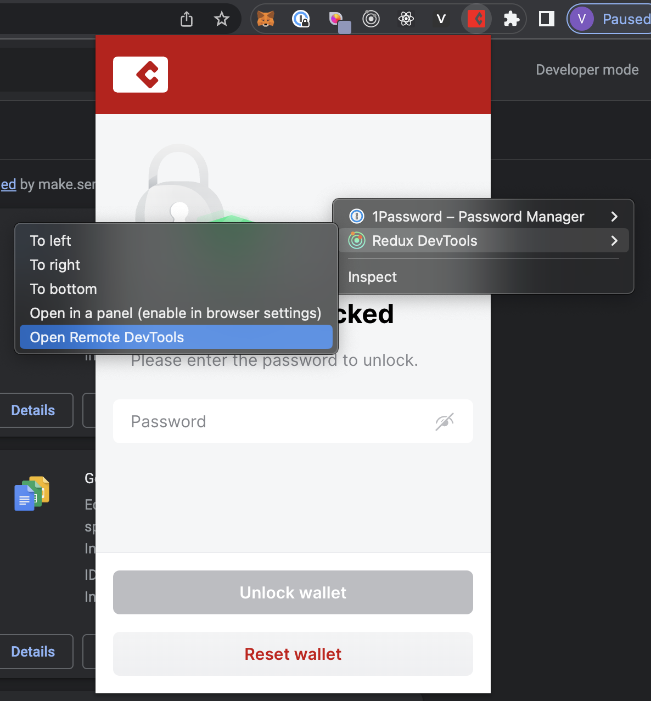
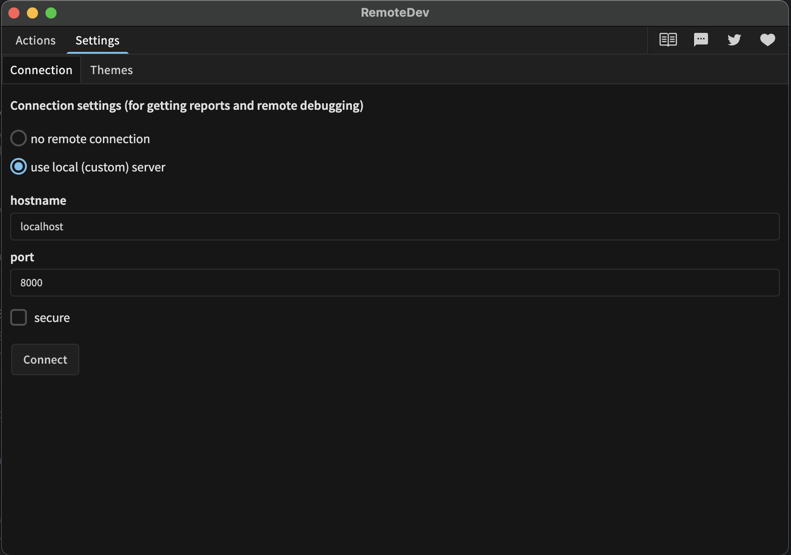

# Casper Wallet


Securely manage your CSPR tokens, interact with dapps and sign transactions with Casper Wallet, the Go-To self-custody wallet for the Casper blockchain.

## Testing Casper Wallet integration on **Casper Wallet Playground**

*Casper Wallet Playground is a React webapp created as a developer tool to help test integration with various features available in Casper Wallet.*

### Access Casper Wallet Playground repo

Open <https://github.com/make-software/casper-wallet>

Clone this repository and run following commands from the repo root folder.
*NOTE: Node.js LTS is required.*

```shell
npm install
npm run start
```

This will open webapp automatically in a new tab.

### Load Wallet Extension in Chrome

1. Navigate `chrome://extensions/` in Chrome browser
2. Enable `Developer mode` (right top corner, at least for Chrome 98)
3. Click on `Load unpacked` button (left top corner)
4. Pick `build/chrome` folder from `builds.zip` deliverable or `builds` folder when building from sources.

To open as a tab:

1. Open a new tab and use the link `chrome-extension://{paste ID here}/popup.html`

### Load Wallet Extension in Firefox

1. Navigate `about:debugging#/runtime/this-firefox` in Firefox browser
2. Click on `Load Temporary Add-on...` button.
3. Pick `build/firefox/manifest.json` file from `builds.zip` deliverable or `builds` folder when building from sources.

To open as a tab:

1. Open new tab and fill the link `moz-extension://{paste Internal UUID here}/popup.html`

### Load Wallet Extension in Safari

1. Open `build/safari` folder from `builds.zip` or `builds` folder when building from sources.
2. Double click on "Casper Wallet.app" file.
3. Follow instructions and enable Casper Wallet in opened Extensions Preferences window.
4. Open Safari and enable unsigned extensions. Extension should be available.

For more information please [follow the link](https://developer.apple.com/documentation/safariservices/safari_web_extensions/running_your_safari_web_extension)

## Development setup

### Install dependencies

Clone this repository and run following commands from the repo root folder.
*NOTE: Node.js LTS is required.*

```shell
npm install
```

### Grant script execution permissions for `scripts` folder

```shell
chmod +x scripts/*
```

### Start watcher script to rebuild on changes (`output` folder)

Chrome:

```shell
npm run start:chrome
```

Firefox:

```shell
npm run start:firefox
```

Safari:

```shell
npm run start:safari
```

You can run all these commands in parallel.

### Build deliverable from sources (`build` folder)

```shell
npm run build:all
```

## Redux DevTools

### What is it?

Developer Tools to power-up Redux development workflow or any other architecture which handles the state change.

It can be used as a browser extension (for Chrome, Edge and Firefox), as a standalone app or as a React component integrated in the client app.

You can read more about Redux DevTools on link <https://github.com/reduxjs/redux-devtools>

### How to configure?

We are using redux devtool as separate local server. It can be started with `devtools:redux` npm start script.

All npm start scripts, except Safari (`start:chrome`, `start:firefox`) for dev-environment, already include launching the redux dev tools on `8000` port for Chrome and `8001` port for Firefox.

You should install Redux DevTools browser extension and connect it to Redux DevTool local server

### How to run?

1. Install browser extension
   - For Chrome - <https://chrome.google.com/webstore/detail/redux-devtools/lmhkpmbekcpmknklioeibfkpmmfibljd?hl=en>
   - For Firefox - <https://addons.mozilla.org/en-US/firefox/addon/reduxdevtools/>
   - Safari not supported 😢

2. Start npm script for browser you need. For example, run `npm run start:chrome` for Chrome
3. Connect your extension with local redux dev server with steps:
    1. Open extension and click by right mouse button on it then pick `Redux DevTools` menu item and click on `Open Remote DevTools`
    2. Open `Settings` of Redux DevTools app then select `use local (custom) server` option and set hostname as a `localhost` and set a port depends on browser you need (`8000` for Chrome and `8001` for Firefox) 
    3. Click `Connect` button and enjoy 🙂

## E2E tests

Write tests into `e2e/tests` folder.

There are a few options to run tests:

1. In docker container
   - Run docker and up containers. `docker compose up` or `docker-compose -f docker-compose.arm.yml up` for Apple M processors
   - Use npm scripts `npm run test:e2e:chrome:headless` or `npm run test:e2e:firefox:headless` depends on target browser
   - To see what is happening inside the container, open your web browser and navigate to the URL <http://localhost:7900> for Chrome and <http://localhost:7901> for Firefox, enter the password `secret`, and run your test again
2. Locally on computer
   - Use npm scripts `npm run test:e2e:chrome` or `npm run test:e2e:firefox` depends on target browser
